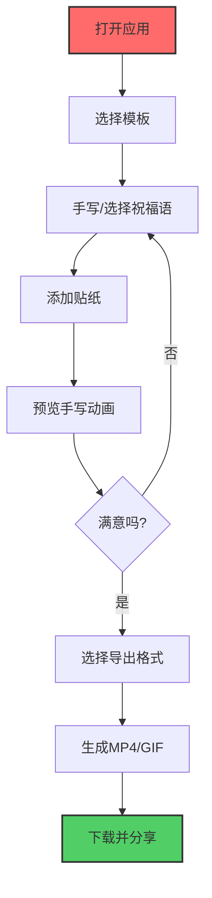

## 1. 产品概述

拜年贺卡工坊是一款创意拜年工具，让用户轻松制作个性化的新春祝福视频。用户可以选择精美模板、手写或选择祝福语、添加动态贴纸，生成带有手写动画效果的拜年贺卡，导出为 MP4 或 GIF 分享到微信群，解决了传统文字祝福缺乏诚意、录制视频害羞的痛点。

## 2. 核心功能

### 2.1 用户角色
| 角色 | 注册方式 | 核心权限 |
|------|----------|----------|
| 普通用户 | 无需注册 | 使用所有功能，包括模板选择、手写、贴纸、导出 |

### 2.2 功能模块
1. **模板选择页**：红金国风 / 简约现代两套主题模板
2. **贺卡编辑页**：Canvas 画布、手写工具、贴纸库、预制祝福语
3. **动画预览页**：笔迹逐字显现动画播放
4. **导出配置页**：MP4/GIF 格式选择、时长设置、质量调节
5. **数据管理**：JSON 笔迹数据导入导出，支持二次编辑

### 2.3 页面详情
| 页面名称 | 模块名称 | 功能描述 |
|----------|----------|----------|
| 贺卡编辑页 | 模板选择器 | 点击切换红金国风/简约现代模板，实时预览背景效果 |
| 贺卡编辑页 | Canvas 画布 | 支持鼠标/触摸手写，可调节笔刷颜色、粗细、透明度 |
| 贺卡编辑页 | 预制祝福语 | 提供「新年快乐」「万事如意」等常用祝福语一键插入 |
| 贺卡编辑页 | 贴纸库 | 灯笼、福字、生肖等贴纸，支持拖拽、缩放、旋转操作 |
| 动画预览页 | 笔迹动画 | 按书写顺序逐笔回放，模拟真人手写效果 |
| 动画预览页 | 播放控制 | 播放/暂停/重播/进度条调节 |
| 导出配置页 | 格式选择 | MP4 / GIF 格式切换，15秒默认时长 |
| 导出配置页 | 质量调节 | 分辨率、帧率、压缩质量参数调节 |
| 数据管理 | JSON 导入导出 | 保存笔迹和贴纸布局数据，支持二次编辑 |

## 3. 核心流程

用户打开应用 → 选择拜年模板 → 在 Canvas 上手写或选择预制祝福语 → 添加并调整贴纸位置 → 预览手写动画效果 → 选择导出格式 (MP4/GIF) → 生成下载文件 → 分享到微信群。

## 4. 用户界面设计

### 4.1 设计风格

**红金国风模板**
- 主色调：正红 #C41E3A、金色 #D4AF37、深酒红 #8B0000
- 装饰元素：祥云纹理、中国结、梅花、剪纸边框
- 字体：书法风格字体，如「汉仪尚魏手书」「方正字迹-童体毛笔」
- 整体氛围：传统喜庆、庄重大气

**简约现代模板**
- 主色调：米白 #FAFAFA、浅金 #E8D5A3、暖橙 #FF8C42
- 装饰元素：几何线条、极简图形、柔和渐变
- 字体：现代无衬线字体，如「思源黑体」「PingFang SC」
- 整体氛围：简洁时尚、年轻活泼

**通用组件风格**
- 按钮：圆润倒角 (8-12px)，微阴影，hover 状态有轻微放大和颜色加深
- 工具栏：半透明磨砂玻璃效果，浮动在画布边缘
- 贴纸选择器：卡片式网格布局，hover 有缩放动效
- 进度条：线性渐变填充，动画流畅自然

### 4.2 页面设计概览
| 页面名称 | 模块名称 | UI 元素 |
|----------|----------|---------|
| 贺卡编辑页 | 顶部工具栏 | 模板切换按钮、撤销/重做、清空、JSON 导入导出按钮 |
| 贺卡编辑页 | 左侧工具栏 | 笔刷工具、文字工具、橡皮擦、颜色选择器、粗细调节 |
| 贺卡编辑页 | 右侧贴纸面板 | 分类标签（装饰/文字/生肖）、贴纸缩略图网格 |
| 贺卡编辑页 | 中心画布区 | Canvas 元素，带模板背景，支持手写和贴纸操作 |
| 贺卡编辑页 | 底部控制栏 | 预制祝福语选择、动画预览按钮、导出按钮 |
| 动画预览页 | 中心预览区 | 大尺寸预览画布，黑色背景突出内容 |
| 动画预览页 | 底部控制栏 | 播放/暂停/重播按钮、进度条、时间显示、返回编辑按钮 |
| 导出配置页 | 配置表单 | 格式单选、分辨率下拉、质量滑块、时长设置 |
| 导出配置页 | 导出进度 | 进度条、百分比显示、取消按钮 |
| 导出配置页 | 完成区域 | 预览缩略图、下载按钮、重新导出按钮 |

### 4.3 响应式设计

- **桌面端（主要）**：三栏布局，左右工具栏 + 中心画布，画布固定 16:9 比例
- **平板端**：左右工具栏折叠为底部标签页，画布自适应
- **移动端**：单栏布局，工具栏改为底部浮动，画布竖屏适配
- 触摸优化：支持触摸手写，贴纸操作区域放大，按钮最小尺寸 44px

### 4.4 动效设计

- **页面加载**：元素错落淡入，工具栏从边缘滑入
- **手写过程**：笔刷跟随光标有轻微拖尾效果
- **贴纸交互**：选中时有高亮边框和控制点，拖拽时有半透明预览
- **动画预览**：笔迹逐笔绘制，笔锋有速度变化，模拟真实书写
- **导出过程**：进度条平滑动画，完成时有成功动效和庆祝粒子
