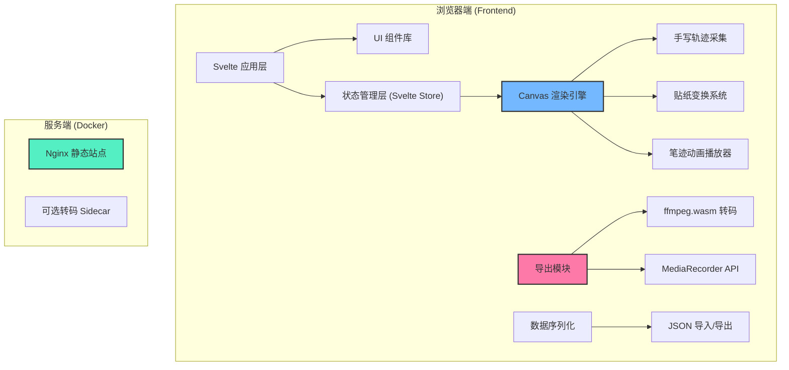

## 1. 架构设计



## 2. 技术描述

### 2.1 技术栈选择
| 层级 | 技术方案 | 版本 | 说明 |
|------|----------|------|------|
| 前端框架 | Svelte | 4.x | 编译型框架，性能优异，适合 Canvas 交互场景 |
| 构建工具 | Vite | 5.x | 极速开发体验，原生 ESM 支持 |
| 语言 | TypeScript | 5.x | 类型安全，提升代码可维护性 |
| 样式 | SCSS + CSS Variables | - | 主题变量管理，两套模板样式切换 |
| Canvas 渲染 | 原生 Canvas 2D API | - | 高性能手写轨迹渲染 |
| 动画 | requestAnimationFrame | - | 60fps 流畅笔迹动画 |
| 视频导出 | ffmpeg.wasm + MediaRecorder | v0.12.x | 客户端 MP4/GIF 转码 |
| 图标 | Material Design Icons | - | 统一图标风格 |

### 2.2 项目目录结构
```
ljx-0295-1/
├── src/
│   ├── components/          # Svelte 组件
│   │   ├── canvas/          # Canvas 相关组件
│   │   │   ├── Canvas.svelte
│   │   │   ├── BrushTool.svelte
│   │   │   └── StickerLayer.svelte
│   │   ├── toolbar/         # 工具栏组件
│   │   │   ├── TopToolbar.svelte
│   │   │   ├── LeftToolbar.svelte
│   │   │   └── BottomBar.svelte
│   │   ├── sticker/         # 贴纸相关
│   │   │   ├── StickerPanel.svelte
│   │   │   └── StickerItem.svelte
│   │   ├── preview/         # 预览相关
│   │   │   ├── PreviewModal.svelte
│   │   │   └── AnimationPlayer.svelte
│   │   ├── export/          # 导出相关
│   │   │   ├── ExportModal.svelte
│   │   │   └── ProgressBar.svelte
│   │   └── common/          # 通用组件
│   ├── stores/              # Svelte Store 状态管理
│   │   ├── canvasStore.ts
│   │   ├── brushStore.ts
│   │   ├── stickerStore.ts
│   │   └── templateStore.ts
│   ├── types/               # TypeScript 类型定义
│   │   ├── canvas.ts
│   │   ├── sticker.ts
│   │   └── export.ts
│   ├── utils/               # 工具函数
│   │   ├── canvas/          # Canvas 工具
│   │   │   ├── renderer.ts
│   │   │   ├── animation.ts
│   │   │   └── serializer.ts
│   │   ├── export/          # 导出工具
│   │   │   ├── ffmpeg.ts
│   │   │   └── recorder.ts
│   │   └── math.ts          # 数学计算（矩阵变换）
│   ├── assets/              # 静态资源
│   │   ├── stickers/        # 贴纸图片
│   │   ├── templates/       # 模板背景
│   │   └── fonts/           # 字体文件
│   ├── data/                # 静态数据
│   │   ├── templates.ts     # 模板配置
│   │   ├── stickers.ts      # 贴纸数据
│   │   └── greetings.ts     # 预制祝福语
│   ├── App.svelte
│   ├── main.ts
│   └── app.scss
├── docker/                  # Docker 相关配置
│   ├── nginx/
│   └── transcoder/
├── docker-compose.yml
├── index.html
├── package.json
├── svelte.config.js
├── tsconfig.json
├── vite.config.ts
└── README.md
```

## 3. 核心模块设计

### 3.1 Canvas 渲染引擎

**核心类：CanvasRenderer**
- 负责模板背景、笔迹、贴纸的分层渲染
- 维护渲染循环 (requestAnimationFrame)
- 支持离屏 Canvas 预渲染优化

**手写轨迹采集**
```typescript
interface StrokePoint {
  x: number;
  y: number;
  pressure: number;      // 笔压（0-1）
  timestamp: number;     // 时间戳（用于动画速度）
}

interface Stroke {
  id: string;
  points: StrokePoint[];
  color: string;
  width: number;
  opacity: number;
  lineCap: 'round' | 'square';
  lineJoin: 'round' | 'bevel' | 'miter';
}
```

### 3.2 贴纸变换系统

**贴纸数据结构**
```typescript
interface Sticker {
  id: string;
  type: 'lantern' | 'fu' | 'zodiac' | 'decoration';
  src: string;           // 图片资源路径
  x: number;             // 中心点 X
  y: number;             // 中心点 Y
  scale: number;         // 缩放比例
  rotation: number;      // 旋转角度（弧度）
  opacity: number;       // 透明度
  zIndex: number;        // 层级
  flipX: boolean;        // X轴翻转
  flipY: boolean;        // Y轴翻转
}
```

**变换矩阵计算**
- 使用 2D 仿射变换矩阵处理缩放、旋转、平移
- 支持控制点拖拽：8个方向缩放 + 1个旋转手柄
- 碰撞检测：基于变换后的包围盒

### 3.3 笔迹动画播放器

**动画原理**
1. 按时间戳将笔迹点分段
2. 计算每段的绘制进度（0-1）
3. 使用贝塞尔曲线平滑连接点
4. 根据进度值动态绘制部分笔画

**速度控制**
- `normal`：1x 原速度
- `slow`：0.5x 慢速
- `fast`：2x 快速
- 总时长自适应为 15 秒（导出默认）

### 3.4 导出模块

**双导出策略**
1. **MediaRecorder 优先**：捕获 Canvas 流，性能最佳，但依赖浏览器支持
2. **ffmpeg.wasm 备选**：逐帧渲染后合成，兼容性好，适合低性能设备

**导出配置**
```typescript
interface ExportConfig {
  format: 'mp4' | 'gif';
  duration: number;           // 秒，默认 15
  resolution: '720p' | '1080p' | '2K';
  fps: 30 | 60;
  quality: 'low' | 'medium' | 'high';
  includeBackground: boolean;
  includeStickers: boolean;
  loop: boolean;              // GIF 循环
}
```

## 4. 状态管理

### 4.1 Canvas Store
```typescript
interface CanvasState {
  width: number;              // 画布宽度
  height: number;             // 画布高度
  scale: number;              // 缩放比例（用于高清屏）
  strokes: Stroke[];          // 所有笔迹
  currentStroke: Stroke | null;
  history: Stroke[][];        // 撤销历史
  redoStack: Stroke[][];      // 重做栈
  isDrawing: boolean;
}
```

### 4.2 Template Store
```typescript
interface Template {
  id: string;
  name: 'red-gold' | 'minimal';
  background: string;         // 背景色/渐变/图片
  borderStyle: string;
  decoration: string[];       // 装饰元素配置
  defaultBrushColor: string;
  fontFamily: string;
}
```

## 5. 数据模型

### 5.1 项目文件格式（JSON）
```json
{
  "version": "1.0",
  "template": "red-gold",
  "canvas": {
    "width": 1920,
    "height": 1080
  },
  "strokes": [
    {
      "id": "stroke-1",
      "points": [
        { "x": 100, "y": 200, "pressure": 0.8, "timestamp": 1000 },
        { "x": 150, "y": 220, "pressure": 0.9, "timestamp": 1050 }
      ],
      "color": "#D4AF37",
      "width": 8,
      "opacity": 1
    }
  ],
  "stickers": [
    {
      "id": "sticker-1",
      "type": "lantern",
      "x": 500,
      "y": 300,
      "scale": 1.2,
      "rotation": 0.1
    }
  ],
  "animationConfig": {
    "speed": 1,
    "duration": 15
  },
  "createdAt": "2026-01-01T00:00:00.000Z",
  "updatedAt": "2026-01-01T00:00:00.000Z"
}
```

## 6. 服务端架构

### 6.1 Docker Compose 配置
```yaml
services:
  web:
    image: nginx:alpine
    ports:
      - "8080:80"
    volumes:
      - ./dist:/usr/share/nginx/html
    restart: unless-stopped

  transcoder:
    image: jrottenberg/ffmpeg:latest
    profiles:
      - optional
    volumes:
      - ./temp:/tmp/transcode
    restart: "no"
```

### 6.2 部署说明
- **静态站点**：Nginx 服务于 dist 目录，纯前端应用
- **可选转码 Sidecar**：通过 profile 控制启动，用于服务端转码（替代客户端 ffmpeg.wasm）
- **CORS 配置**：Nginx 配置允许跨域，支持字体和图片加载

## 7. 性能优化策略

1. **Canvas 分层渲染**
   - 背景层：静态，一次渲染
   - 笔迹层：动态，使用离屏 Canvas 缓存
   - 贴纸层：按需渲染

2. **笔迹点采样**
   - 根据移动速度动态采样，减少点数
   - 贝塞尔曲线平滑处理

3. **导出优化**
   - 15秒导出按帧渲染，使用 Web Worker
   - 进度条实时更新，避免 UI 阻塞

4. **内存管理**
   - 撤销历史限制为 50 步
   - 导出完成后清理临时数据
